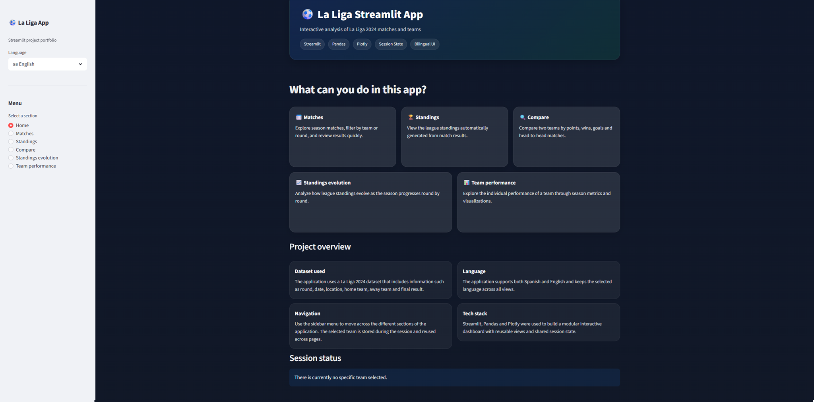
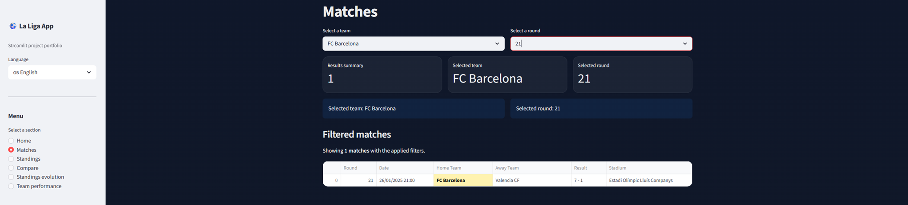
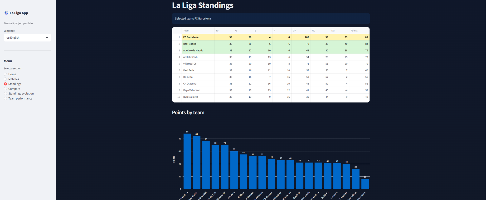
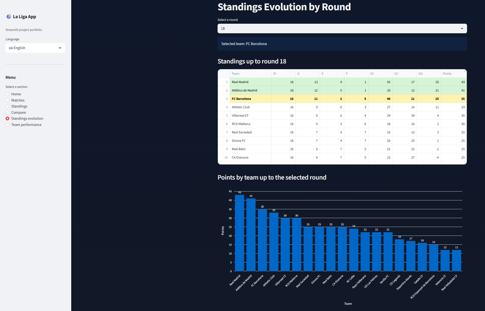
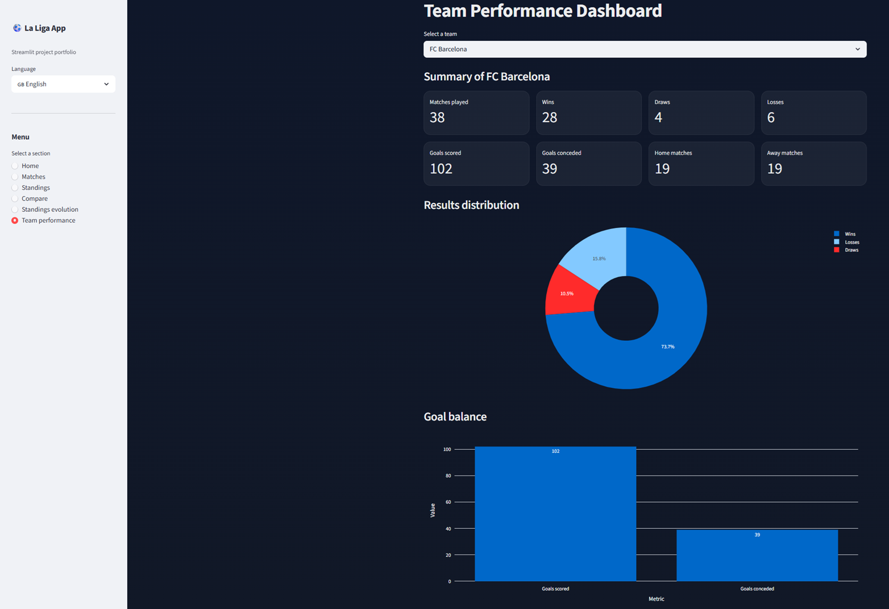
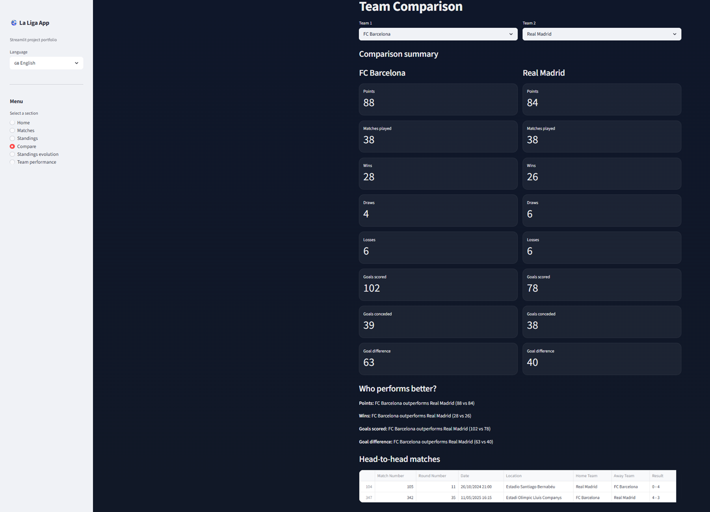

# La Liga Streamlit App

An interactive **Streamlit** dashboard built to explore and analyze **La Liga 2024** match data.

This project was created to practice and demonstrate skills in **data analysis**, **interactive dashboard development**, **state management in Streamlit**, and **modular Python project structure**.

## Features

The application is organized into multiple interactive views accessible from the sidebar:

### Home
A landing page that introduces the project and provides an overview of the available features.

### Matches
Explore all season matches with dynamic filters.

- Filter matches by **team**
- Filter matches by **round**
- View results in a structured table
- Automatically highlight the selected team
- Keep filters persistent across views using **Streamlit Session State**

### Standings
Generate the **league table** dynamically from match results.

Includes:

- Points
- Wins
- Draws
- Losses
- Goals scored
- Goals conceded
- Goal difference

Additional features:

- Highlight the **Top 4 teams**
- Highlight the **relegation zone**
- Highlight the **currently selected team**

Also includes a **bar chart of points per team**.

### Standings Evolution
Analyze how the league table evolves during the season.

- Select a specific **round**
- View standings **up to that round**
- Visualize points by team at that stage
- Track progression across the season

### Team Comparison
Compare two teams using key performance indicators.

Includes:

- Points
- Matches played
- Wins / Draws / Losses
- Goals scored
- Goals conceded
- Goal difference

Also displays **head-to-head matches** between both teams.

### Team Performance Dashboard
A dedicated dashboard focused on a single team.

Includes:

- Matches played
- Wins, draws and losses
- Goals scored and conceded
- Home vs away distribution

Visualizations:

- Results distribution (**pie chart**)
- Goal balance (**bar chart**)

## Multi-language Support

The app supports:

- Spanish 🇪🇸
- English 🇬🇧

Language can be changed dynamically from the sidebar.

Highlights:

- Language selection persists across views
- UI text is managed through a centralized **translations system**
- Internal logic remains language-independent

## Session State & UX

The application uses **Streamlit Session State** to create a more consistent user experience.

- Selected team is shared across views
- Filters persist while navigating
- Navigation state is preserved
- Language selection is maintained globally

This makes the project behave more like a small **data product** than a simple script.

## Dataset

The application uses a dataset containing **La Liga 2024 match results**.

Fields included:

- Match Number
- Round Number
- Date
- Location
- Home Team
- Away Team
- Result

League standings are calculated dynamically from these match results.

## Data Source

Dataset source:  
`https://fixturedownload.com/results/la-liga-2024`

Time zone used in the dataset:  
**UTC+01:00 — Brussels, Copenhagen, Madrid, Paris**

## Technologies Used

- Python
- Streamlit
- Pandas
- Plotly

## App Preview

### Home


### Matches


### Standings


### Standings Evolution


### Team Performance


### Team Comparison


## License

This project is licensed under the MIT License.

## Project Structure

```text
la_liga_streamlit_app/
│
├── main.py
├── requirements.txt
├── README.md
│
├── data/
│   └── la-liga-2024.csv
│
├── views/
│   ├── home.py
│   ├── matches.py
│   ├── standings.py
│   ├── compare_teams.py
│   ├── standings_evolution.py
│   └── team_dashboard.py
│
└── utils/
    ├── data_loader.py
    ├── match_utils.py
    ├── standings_utils.py
    └── translations.py
```

---

# How to Run the Application

## Clone the repository

```bash
git clone https://github.com/your-username/la-liga-streamlit-app.git
```

## Navigate into the project folder

```bash
cd la-liga-streamlit-app
```

## Create a virtual environment

```bash
python -m venv venv
```

Activate it:

Windows

```bash
venv\Scripts\activate
```

Mac / Linux

```bash
source venv/bin/activate
```

## Install dependencies

```bash
pip install -r requirements.txt
```

## Run the Streamlit application

```bash
streamlit run main.py
```

## Notes

This project was developed as a practical Streamlit application to consolidate concepts such as:

- interactive dashboards  
- reusable view-based architecture  
- session state management  
- basic sports analytics  
- bilingual UI support
